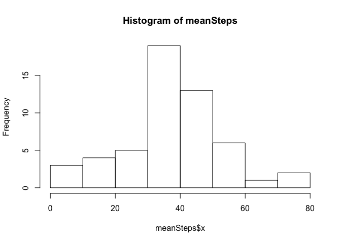
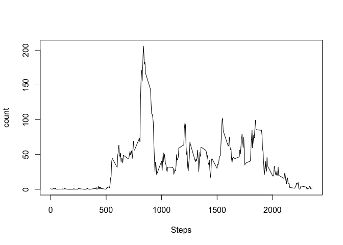
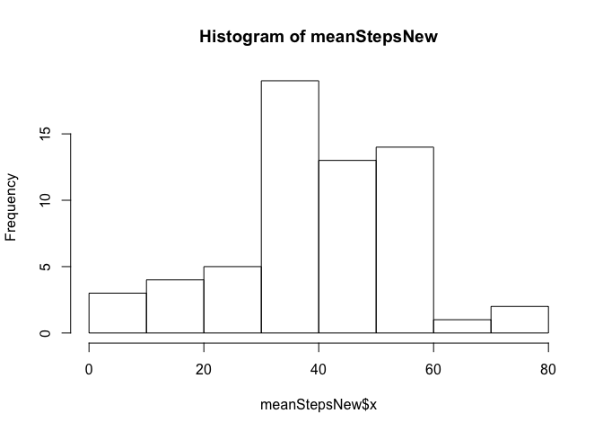
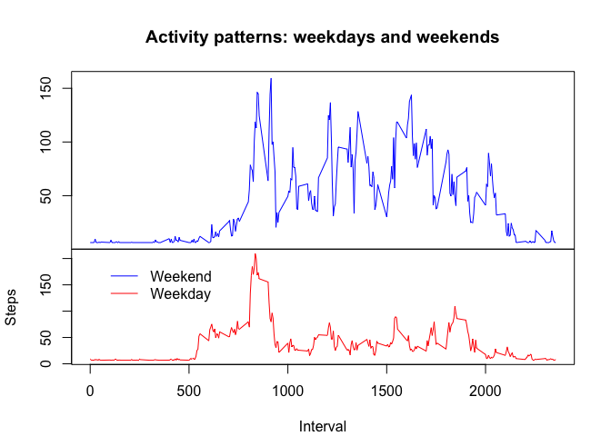

# Reproducible Research: Peer Assessment 1


## Loading and preprocessing the data

```r
unzip("activity.zip")
activity <- read.csv("activity.csv", sep = ",")
```

## What is mean total number of steps taken per day?


```r
meanSteps <- aggregate(activity$steps, list(activity$date), mean)
hist(meanSteps$x, main = paste("Histogram of meanSteps"))
```

 

```r
meanS <- mean(meanSteps$x, na.rm=T)
medianS <- median(meanSteps$x, na.rm=T)
```


## What is the average daily activity pattern?


```r
nona <- na.omit(activity)
meansIntervals <- aggregate(nona$steps, list(nona$interval), mean)
plot(meansIntervals, type="l", xlab="Steps", ylab="count")
```

 

```r
###The 5-minute interval that, on average, contains the maximum number of steps
maxStepsInterval <- which(meansIntervals$x==max(meansIntervals$x), arr.ind=TRUE)
```


## Imputing missing values

```r
###Total number of missing values
naNumber <- sum(is.na(activity$steps))
###New data set where NA values replaces with means from the 5 minute interval across the dataset
newData <- activity
for (i in 1:length(activity$date)){
      if (is.na(newData[i,1])){
            newData[i,1] <- meansIntervals$x[which(meansIntervals==newData[90,3])]
      }
      else{}
}
###Histogram, mean, median with new data
meanStepsNew <- aggregate(newData$steps, list(newData$date), mean)
hist(meanStepsNew$x, main = paste("Histogram of meanStepsNew"))
```

 

```r
meanNew <- mean(meanStepsNew$x, na.rm=T)
medianNew <- median(meanStepsNew$x, na.rm=T)
```


## Are there differences in activity patterns between weekdays and weekends?

```r
library(timeDate)
newData$date <- as.Date(newData$date)
for (i in 1:length(newData$date)){
      if (isWeekday(newData$date[i])){
            newData$day[i] <-"weekday"
      } else{ newData$day[i] <-"weekend"}
}
newData$day <- as.factor(newData$day)
weekendMean <- aggregate(newData$steps[which(newData$day == "weekend")], list(newData$interval[which(newData$day == "weekend")]), mean)
weekdayMean <- aggregate(newData$steps[which(newData$day == "weekday")], list(newData$interval[which(newData$day == "weekday")]), mean)

layout(matrix(1:2, ncol = 1), widths = 1, heights = c(2,1.5), respect = FALSE)
par(mar = c(0, 4.1, 4.1, 2.1))
with(weekendMean, plot(x~Group.1, type = 'l', xlab="Interval",col="blue", ylab="", xaxt = 'n', main = 'Activity patterns: weekdays and weekends'))
par(mar = c(4.1, 4.1, 0, 2.1))
with(weekdayMean, plot(x~Group.1, type = 'l',xlab="Interval", col="red", ylab="Steps"))
legend(40,200, lty=c(1,1),  bty = "n",c("Weekend","Weekday"),col=c("blue","red")) 
```

 


